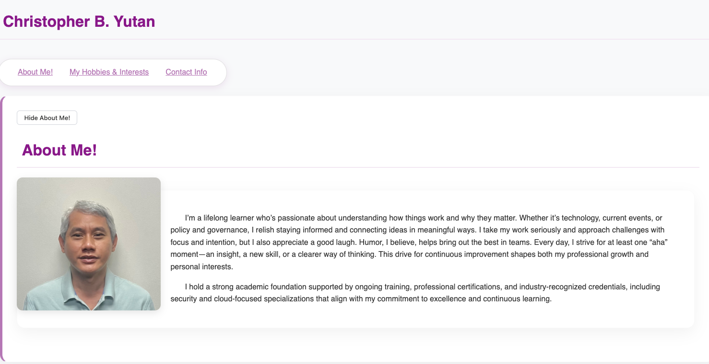
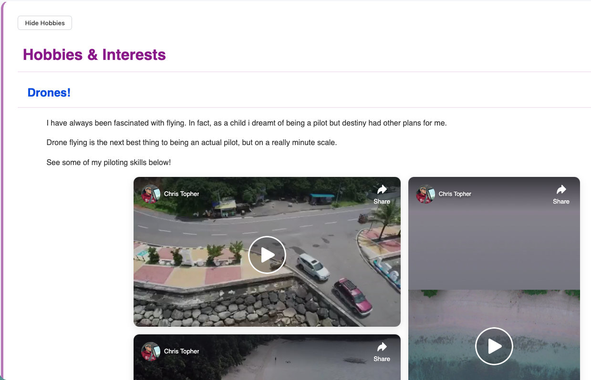

Mini-Project Web Page
    A responsive, modern web page showcasing hobbies like drones, photography, and more. Built with HTML and CSS for a clean, user-friendly experience.

Features
    Responsive Design: Works seamlessly on all screen sizes (desktop, tablet, mobile).
    Grid Layout: Clean, organized sections for hobbies like drones, shooting, and more.
    Media Integration: Responsive iframes and images for embedded content.
    Mobile-Friendly: Vertical stacking and flexible layouts for smaller screens.
    Pure HTML/CSS: No JavaScript required — lightweight and easy to customize.
 
Technologies Used
    HTML5
    CSS (Flexbox, Grid, Responsive Design)
    JavaScript

Project Structure
    mini-project/  
    │  
    ├--- css 
    |------ styles5.css         // CSS styling  
    |--- images
    |------ CY-01.jpeg
    |------ CY-02.jpg
    |------ CY-03.png
    |------ PS-01.png
    |------ PS-02.png
    |------ PS-03.png
    |------ ID-photo-01.png
    |--- script
    |------ showhide.js
    |--- index.html        // Main HTML file  
    └--- README.md         // This file  

How to Run
    Clone the Repository:
    1. git clone https://github.com/your-username/your-repo-name.git
    2. Open in Browser:
    3. Navigate to index.html in your browser.
    4. Or use a local server (e.g., python -m http.server if you have Python installed).

Preview
    
    

Live Demo 
    [Visit my website for a live demo!] (https://cmsc207mp.innocomptel.com)

License: This project is licensed under the MIT License.

Notes
    All media (images, iframes) are responsive and scale automatically.
    Grid layouts use CSS Grid and Flexbox for flexibility.
    Mobile-first approach ensures optimal viewing on all devices.

To-Do List (Future Enhancements)
    Expand sections with more hobbies or content.
    Add comment section
